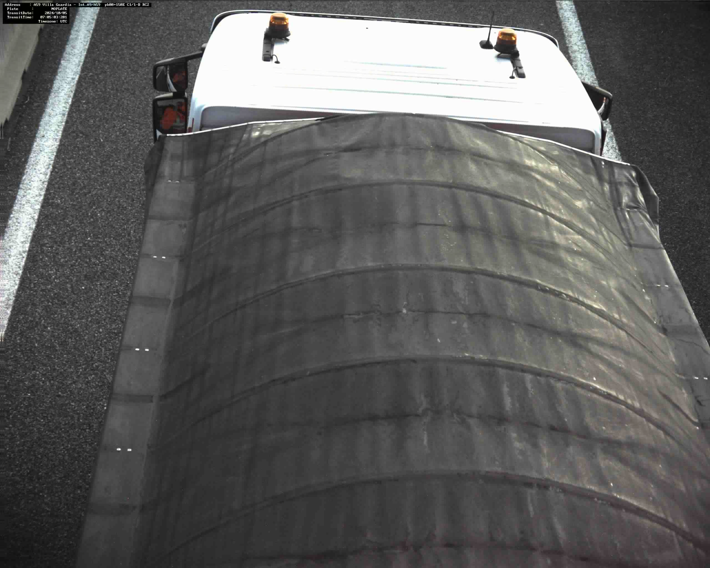
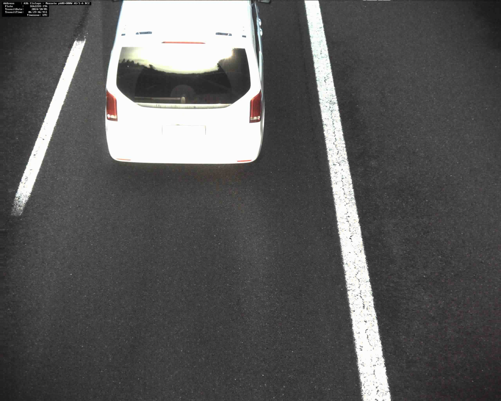
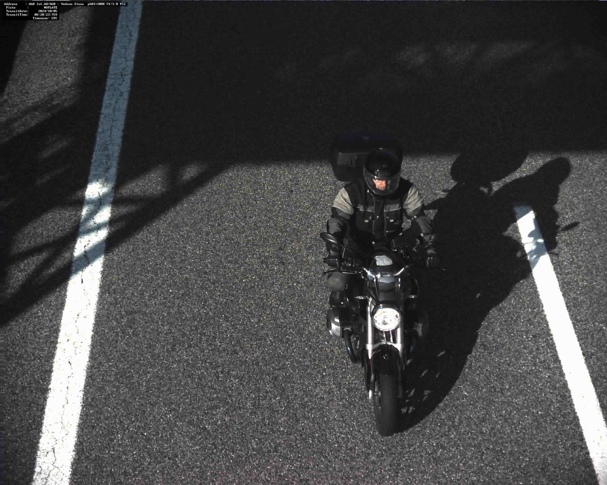
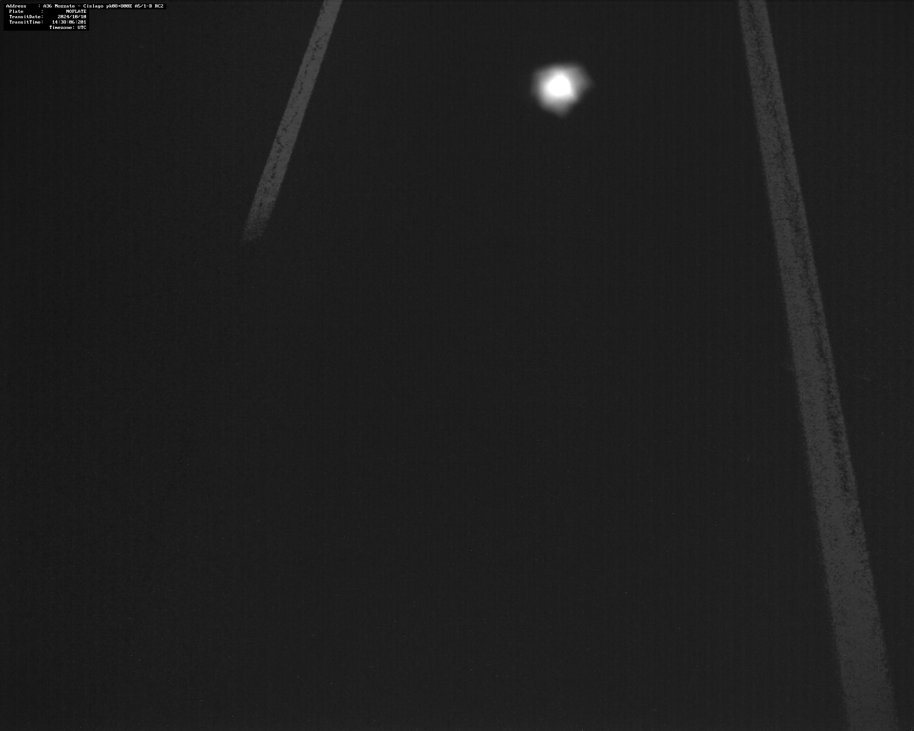
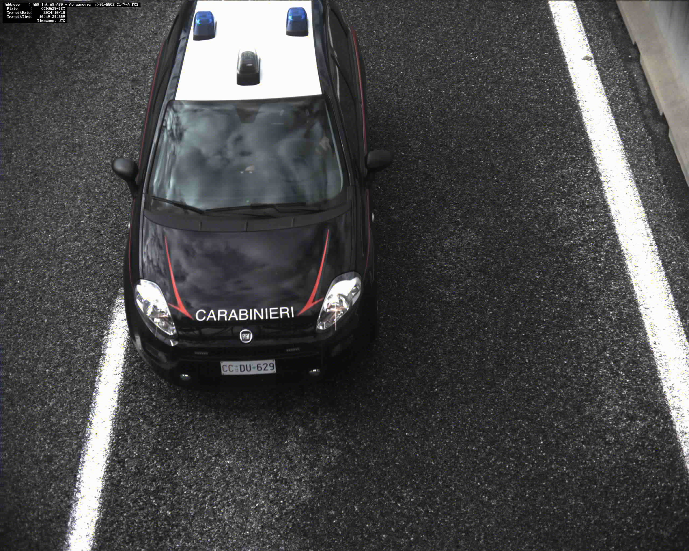
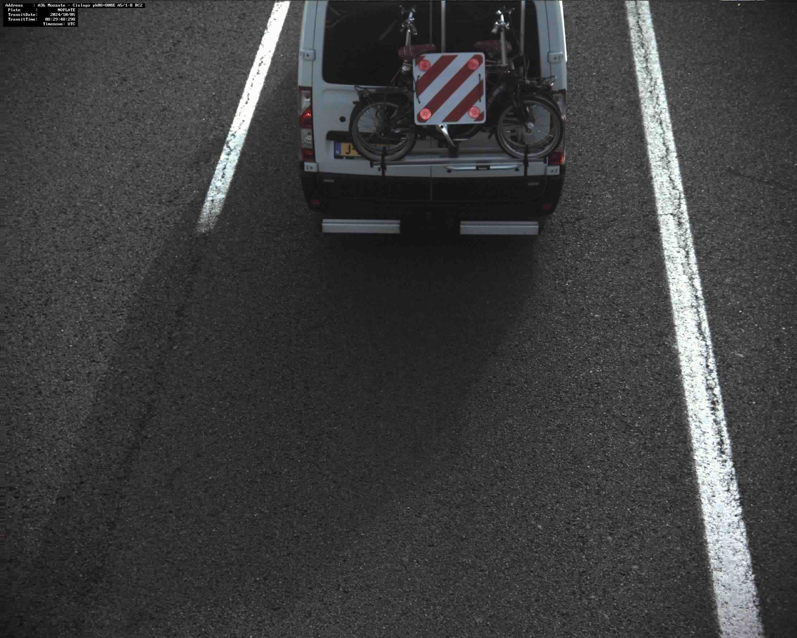
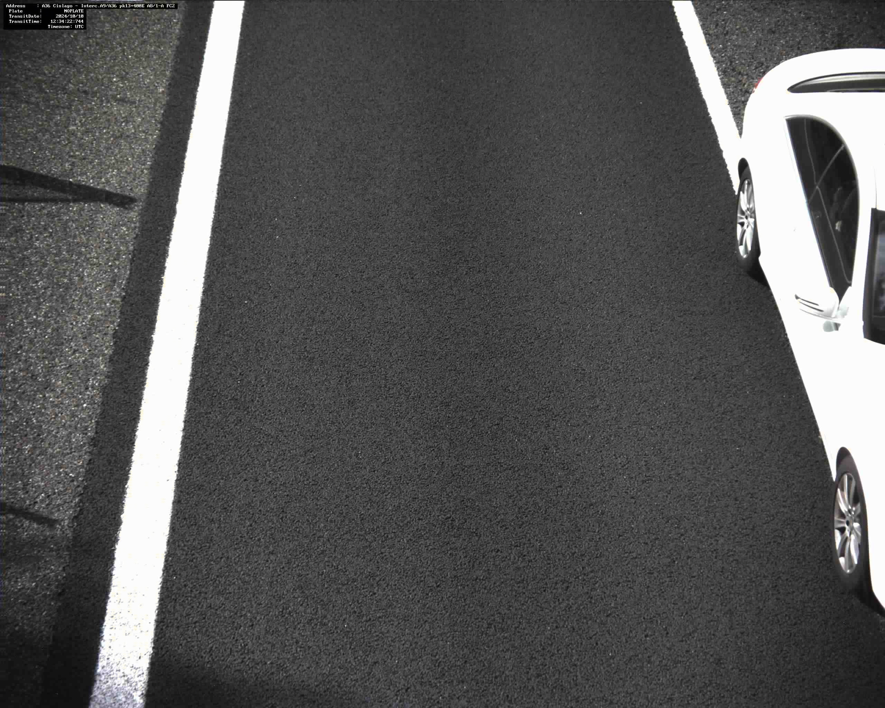
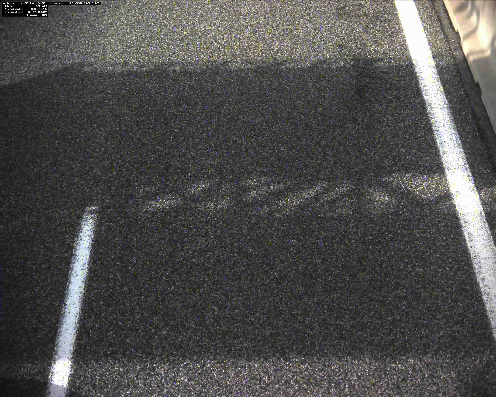

# Dashboard Controllo Transiti e Validazione Foto

## Introduzione
L'analisi è stata svolta su un campione del 50% degli scarti registrati. 
L'obiettivo è fornire una panoramica dettagliata delle categorie di scarto, con una leggenda e immagini di esempio, per comprendere meglio i motivi per cui alcune foto sono state scartate;
inoltre vi illustresemo il numero di transiti (passaggio di un veicolo da un portale) che vengono persi e che vengono registrati solo parzialmente per avere una panoramic completa della situazione.

## Categorie di Scarto

### 1. Errore
- **Descrizione:** Immagini che presentano problemi tecnici non classificabili in altre categorie.

---

### 2. Illeggibile
- **Descrizione:** La foto è sfocata o presenta artefatti che impediscono di leggere correttamente la targa o altri dettagli.

---

### 3. Moto Fronte
- **Descrizione:** La foto cattura una moto di fronte, rendendo impossibile identificare la targa, che si trova sul retro.

---

### 4. Scura
- **Descrizione:** L'immagine è troppo scura per distinguere la targa o altri dettagli utili.

---

### 5. Speciali
- **Descrizione:** Immagini che richiedono un'analisi particolare o appartengono a casi unici. In questa categoria rientrano ambulanze, forze dell'ordine, targhe prova, veicoli militari e simili.

---

### 6. Targa coperta
- **Descrizione:** La targa del veicolo è parzialmente o completamente coperta da oggetti, come fango, neve, o altri ostacoli.

---

### 7. Veicolo a metà
- **Descrizione:** Solo una parte del veicolo è visibile, rendendo difficile l'identificazione.

---

### 8. Vuote
- **Descrizione:** L'immagine non contiene alcun veicolo o oggetto di interesse.

## Sottocategorie di Scarto
Per analizzare al meglio le macrocategorie, gli scarti sono stati ulteriormente suddivisi in sottocategorie più dettagliate:

- **Posizionamento camera:** Problemi legati al posizionamento delle telecamere.
- **Ricerca targa:** Difficoltà nell'identificare la targa nell'immagine.
- **Sfocate:** Immagini sfocate che rendono le targe illeggibili.
- **Targa rovinata:** Targhe danneggiate o rovinate.
- **Targa a metà:** Solo una parte della targa è visibile.
- **Riflesso:** Presenza di riflessi che oscurano i dettagli.
- **Oggetto:** Presenza di oggetti che impediscono la visualizzazione della targa.
- **Spostamento veicolo:** Movimento del veicolo durante lo scatto.
- **Scatto a vuoto:** Immagini catturate senza alcun soggetto.
- **Luminosità scarsa:** Illuminazione insufficiente che rende difficile la lettura della targa.

## Obiettivi dell'Analisi
1. Identificare le cause principali degli scarti e proporre soluzioni per ridurre il numero di immagini inutilizzabili.
2. Valutare l'impatto di fattori esterni, come fascia oraria e manutenzione delle telecamere.
3. Esaminare i transiti scartati, studiando il motivo e le caratteristiche di essi per ridurli al minimo.

## Proposte di Miglioramento
- **Manutenzione delle telecamere:** Controlli regolari per verificare il corretto funzionamento.
- **Ottimizzazione del sistema di illuminazione:** Ridurre il numero di foto scure.
- **Controllo della qualità:** Implementare un software di rilevamento automatico per scartare le immagini vuote o illeggibili.

## Conclusione
L'analisi delle foto scartate è un passaggio cruciale per migliorare il sistema di sorveglianza autostradale.

Riducendo il numero di immagini inutilizzabili, si ottimizzerà l'efficienza del sistema e si migliorerà la sicurezza complessiva.